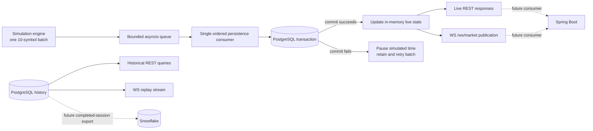
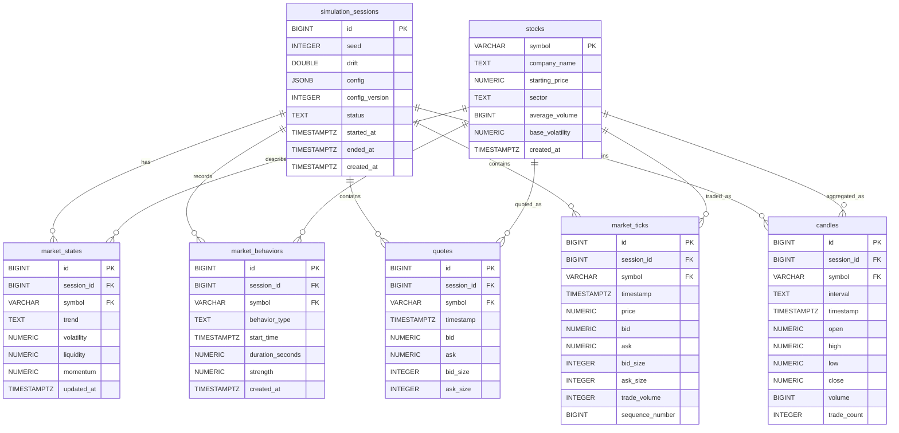

# Phase 12 — Historical Storage and Replay Architecture

Phase 12 will make simulation runs durable and replayable without changing how the simulation mathematics work. PostgreSQL will store completed market events, while the existing in-memory state will continue serving the current low-latency REST and WebSocket interfaces.

This document is the implementation design for Phase 12. It does not mean that the proposed application wiring, API routes, dependencies, or schema changes have already been implemented.

## Goals and Boundaries

Phase 12 will:

- Store each simulation run as a distinct session with its seed, complete configuration, simulated start and end times, lifecycle status, and configuration version.
- Persist ticks, matching quotes, completed candles, market-state snapshots, and behavior history.
- Preserve an unambiguous global tick order so a recorded session can be replayed exactly.
- Keep current live reads and streaming responsive by retaining the existing process-local state.
- Provide historical queries and a timed replay stream without coupling consumers to the simulation engine.
- Stop safely when durable storage is unavailable rather than create gaps in a supposedly complete recording.

Phase 12 will not add trading, orders, portfolios, user accounts, authentication, brokerage behavior, or real-money functionality. It will also not implement Snowflake ingestion, a Spring Boot service, Redis, or an external message broker.

## System Context and Technology Roles

| Technology | Phase 12 role | Simple explanation |
| --- | --- | --- |
| Python/FastAPI | Owns simulation, operational persistence, live APIs, historical APIs, and replay | Keeping one owner avoids splitting a transaction across Python and Java. |
| PostgreSQL | Authoritative operational record | If a session is described as persisted, PostgreSQL is the source of truth for what it contains. |
| In-memory dictionaries/deques | Current live state and bounded recent history | They keep live requests fast, but they are not durable and are rebuilt by running or loading a session. |
| Snowflake | Future analytical destination | It is suited to large scans, reporting, and BI, but not the synchronous commit path for live replay. |
| Spring Boot | Future downstream consumer or separately deployed application service | It can consume stable FMS REST/WebSocket contracts later without owning Phase 12 writes. |

PostgreSQL and Snowflake have intentionally different responsibilities. PostgreSQL answers operational questions such as “what is the next tick in this replay?” Snowflake would later answer analytical questions such as “how did volatility behave across thousands of sessions?” Completed, committed sessions can eventually be exported to Snowflake through an idempotent export ledger or outbox.

## Proposed Data Flow



At the current cadence, the service generates one tick for each of 10 stocks every 250 milliseconds: about 40 ticks per second. A bounded in-process queue and one ordered database writer are sufficient for that workload. The queue size and transaction batch size must be configurable and measured during implementation.

The unit placed on the queue is a complete `PersistenceBatch`, not an individual row. It contains:

- The session identifier and batch/global sequence boundaries.
- The 10 generated `MarketTick` values in global sequence order.
- The `Quote` produced from each tick.
- Any `Candle` values completed by those ticks.
- Any market-state or behavior changes that belong to the same logical step.

The persistence consumer writes the whole batch in one PostgreSQL transaction. Only after the transaction commits may the service update its public live history and publish the corresponding events. This is **commit-before-publish**: a client never receives an event that the system later claims was never recorded.

## CAP Theorem Decision

CAP describes a distributed system during a network partition, when two components cannot reliably communicate. During that failure, a system cannot guarantee both perfect consistency and uninterrupted availability.

FMS chooses **consistency over availability for persisted sessions**:

- Consistency means a replay has no acknowledged-but-missing ticks and preserves one authoritative order.
- Reduced availability means live generation pauses if PostgreSQL cannot commit the next batch.
- Partition tolerance is unavoidable once FastAPI and PostgreSQL communicate over a network, so the system must define its behavior rather than assume the partition cannot happen.

If PostgreSQL becomes unavailable, FMS will keep the uncommitted batch in memory, stop advancing simulated time, set the session and health state to degraded, and retry with bounded exponential backoff. It will not generate later batches until the pending batch commits. This favors trustworthy replay over an uninterrupted but incomplete recording.

This policy does not provide crash-proof buffering while the database is down. Continuing safely across a process crash would require a local durable spool or external durable broker, which is deliberately deferred. Because the uncommitted batch was never published, its loss cannot create a false durability promise to clients.

## Database Model Selection

### SQL — selected

PostgreSQL tables fit this workload because sessions, stocks, ticks, candles, quotes, states, and behaviors have stable fields and important relationships. Foreign keys and constraints prevent orphaned or internally invalid market records. Transactions let one generated batch become visible as a complete unit.

### Document/JSON — selected for configuration only

`simulation_sessions.config` remains JSONB because configuration will evolve and not every setting warrants a new column. The document must be versioned through `config_version`, validated before storage, and treated as immutable after session creation. Frequently filtered or constrained market values remain normal SQL columns.

### Key-value — process-local use only

The existing dictionaries and deques act like a key-value store for the latest quote and recent history by symbol. They are useful for fast live access but are not the historical source of truth. Redis is not required for a single-process service at the current event rate.

### Wide-column — not selected

A wide-column database is useful for massive horizontally distributed write workloads. Forty ticks per second and 10 symbols do not justify its operational complexity. Reconsider it only after measured PostgreSQL limits, much larger symbol counts, or multi-region ingestion make horizontal partitioning necessary.

### Graph — not selected

The current relationships are conventional foreign-key relationships, not deep graph traversals. PostgreSQL joins express them clearly. A graph database would become relevant only if future work centered on complex relationship traversal such as ownership, correlated instruments, or dependency networks.

### Vector — not selected

Phase 12 performs exact filtering and ordered replay, not semantic similarity search. A vector database would be useful only for a later AI/search feature involving embeddings, which is outside the simulator roadmap.

## Target PostgreSQL Structure

The following diagram represents the **target Phase 12 schema**. The existing migrations already create all seven tables. Fields marked as proposed below the diagram, plus revised ordering constraints and indexes, require future migrations and do not exist yet.



### Current versus proposed schema

The current SQL already provides primary keys, all diagrammed foreign keys, value checks, a unique current state per `(session_id, symbol)`, a unique candle per `(session_id, symbol, interval, timestamp)`, and timestamp lookup indexes.

Phase 12 implementation will add or revise:

- `simulation_sessions.status`, constrained to `running`, `paused`, `completed`, `failed`, or `reset`.
- `simulation_sessions.config_version`, a positive integer identifying how to interpret the immutable JSONB configuration.
- A unique constraint on `market_ticks(session_id, sequence_number)`. The tick engine currently generates a global sequence across all symbols, so replay order must not be modeled as merely per-symbol.
- A replay index on `market_ticks(session_id, sequence_number)` for the unfiltered stream.
- A filtered replay index on `market_ticks(session_id, symbol, sequence_number)`.
- Cursor indexes on `candles(session_id, symbol, interval, timestamp)` and the existing session/symbol timestamp paths.
- Idempotency constraints for records written during a retried batch. Existing candle uniqueness is sufficient for candles; quotes will need an appropriate session/symbol/timestamp identity if they continue to be stored independently.

All session-owned rows retain `ON DELETE CASCADE`. Deleting a session is therefore explicit and destructive, but it cannot leave orphaned market data. Implementations must resolve and confirm the exact session target before exposing any deletion operation.

## Session Lifecycle

| Event | Required behavior |
| --- | --- |
| First `start` after initialization or reset | Create a session with immutable seed/configuration metadata, then begin generation. |
| `pause` | Commit the current batch, stop advancement, and retain the session for later continuation. |
| `resume` | Continue the same session and sequence from its paused state. |
| `reset` | Stop and finalize the current session with status `reset`; clear live state; create no replacement until the next start. |
| Normal completion | Drain pending committed work, set `ended_at`, and mark the session `completed`. |
| Graceful application shutdown | Stop generation, drain the queue within a configured timeout, finalize the session, and close the database pool. |
| PostgreSQL failure | Retain the pending batch, pause simulated time, expose degraded health, and retry without creating a new batch. |
| Unrecoverable storage failure | Leave the session non-completed and report `failed`; never present it as a complete replay. |

Repeated lifecycle requests should be idempotent. For example, pausing an already paused session must not create a new session, and retrying finalization must not change previously committed market records.

## Caching Design

A cache is a faster temporary copy of data. A **cache hit** returns that copy quickly; a **cache miss** must read the slower authoritative store. A **TTL** deletes or expires a cached item after a configured time. **Stale data** is a cached value older than its source. A **thundering herd** occurs when many clients miss simultaneously and all query the database. **Cache inconsistency** means the cache and database disagree.

Phase 12 will not add Redis or a distributed cache:

- Live endpoints already read process-local state without a database round trip.
- Historical queries are bounded and cursor-paginated rather than loading entire sessions.
- Replay consumers prefetch bounded database pages; prefetching is not treated as an authoritative cache.
- There is no measured database contention or thundering-herd problem yet.

The live state behaves most like a write-through view: a batch commits to PostgreSQL first and is then reflected in memory before publication. PostgreSQL always wins if the two disagree. Historical responses must not be cached with long TTLs because completed and active sessions have different freshness rules.

Redis should be reconsidered during Phase 14 only if measurements show repeated expensive reads, multiple FastAPI workers needing shared latest-state data, or excessive database load. If added, use cache-aside for immutable completed-session pages and short-lived latest-state keys with explicit invalidation. Never use write-behind caching for authoritative ticks because a cache failure could lose accepted history.

## Queue and Backpressure Design

A **producer** adds work to a queue, and a **consumer** processes it. The queue decouples generation from the mechanics of a database transaction and can briefly absorb a traffic spike. **Backpressure** means slowing or pausing the producer when consumers cannot keep up. An **idempotent consumer** can safely process the same batch more than once. A **growing queue** signals that persistence throughput is below generation throughput.

Phase 12 uses a bounded `asyncio.Queue` and one persistence consumer:

- A bounded queue prevents unbounded memory growth.
- A single consumer preserves global batch order.
- When the queue reaches its high-water mark, generation pauses instead of dropping data.
- Each batch carries a stable identity or stable record keys so a retry is idempotent.
- Queue depth, oldest pending age, retry count, and last error are observable.

This queue is asynchronous but not durable across a process crash. That is acceptable because events are published only after their database commit. A traditional dead-letter queue is not introduced: an invalid generated batch is a programming/data-integrity failure and should fail the session visibly rather than be skipped. Retryable connection errors remain pending; non-retryable constraint or validation failures mark the session failed and preserve diagnostics.

Kafka is appropriate later if FMS needs a high-volume durable event log, independent consumer groups, long broker retention, or replay outside PostgreSQL. RabbitMQ or SQS is appropriate if FMS needs distributed work routing, retries, and DLQs for asynchronous jobs. Neither is justified for the current single-process, approximately 40-tick-per-second workload.

## Storage Boundary

Simulation code must depend on a storage interface rather than PostgreSQL-specific SQL. The future storage package will define operations equivalent to:

- Create, read, list, transition, and finalize simulation sessions.
- Persist one `PersistenceBatch` atomically.
- Read ticks using a session/global-sequence cursor and optional symbol filter.
- Read candles using a session/timestamp cursor plus symbol and interval.
- Load session metadata required to authorize a replay as complete or explicitly partial.
- Report storage readiness and shutdown/drain state.

The PostgreSQL adapter will own pooling, transactions, bulk inserts, conflict handling, cursor queries, and error classification. `SimulationService` will own lifecycle coordination and decide when committed data becomes visible. API and WebSocket modules will not execute SQL directly.

## Proposed Historical Interfaces

These interfaces are design targets and are not implemented by this document.

### Session and history REST APIs

- `GET /simulation/sessions?cursor=<id>&limit=<n>` lists sessions in a stable order with bounded cursor pagination.
- `GET /simulation/sessions/{session_id}` returns seed, configuration/version, lifecycle status, simulated start/end times, creation time, and record counts when available.
- `GET /simulation/sessions/{session_id}/ticks?symbol=<symbol>&after_sequence=<n>&limit=<n>` returns ticks in ascending global sequence order.
- `GET /simulation/sessions/{session_id}/candles?symbol=<symbol>&interval=<interval>&after_timestamp=<timestamp>&limit=<n>` returns candles in ascending bucket-time order.

Limits must be bounded and validated. Unknown sessions or symbols return `404`; malformed cursors and unsupported intervals return `422`. Active or failed sessions may be queried as partial history but must be labeled clearly and must not be advertised as complete replay sources.

### Replay WebSocket

`WS /ws/replay/{session_id}` accepts optional `symbols` and `channels` filters plus an initial playback speed. Each connection owns its cursor and playback state; one client pausing must not affect another client or the live simulator.

Server events use the established envelope fields `type`, `timestamp`, nullable `symbol`, and `data`. Replay sends persisted ticks in global sequence order, reconstructs a matching quote event from each tick, and feeds ticks through `CandleAggregator` so candle events occur at their original logical boundaries. Recorded simulated timestamps remain unchanged; only the wall-clock delay between emissions is divided by playback speed.

Client control messages are:

```json
{"action": "pause"}
{"action": "resume"}
{"action": "set_speed", "speed": 2.0}
{"action": "stop"}
```

Invalid commands return a typed error without terminating a healthy replay. Speed must be positive and bounded. `stop` closes the replay normally. The server sends explicit replay-start, replay-complete, and replay-error status envelopes.

## Health and Observability

Simulation status and health diagnostics will add:

- `persistence_enabled`
- `storage_status` such as `ready`, `degraded`, `draining`, or `unavailable`
- `current_session_id`
- `persistence_queue_depth`
- `pending_batch_count`
- `oldest_pending_batch_age_ms`
- `last_persistence_error` with a safe summary and timestamp

Logs should include session ID, batch sequence boundaries, row counts, commit latency, retry count, and error class. They must not log database credentials or entire batches. Metrics introduced during implementation should expose generation rate, commit rate, transaction latency, queue depth, retries, and replay lag.

## Retention and Capacity

Phase 12 initially retains every raw tick, quote, candle, behavior, and session record until an explicit session deletion. There is no automatic TTL or archive job. This makes replay semantics easy to understand and avoids deleting data before actual usage is measured.

Implementation must measure average encoded row size and calculate expected growth using the real schema. At the current rate, ticks alone grow at approximately 144,000 rows per simulated hour, before quotes, candles, indexes, and PostgreSQL overhead. Capacity documentation must therefore report per-session row counts and measured disk use rather than relying only on raw field sizes.

Later retention can keep session metadata and candles longer than raw ticks, or export completed sessions to Snowflake/object storage before deletion. Such a policy requires explicit product requirements and must never silently turn a previously complete replay into a partial one.

## Alternatives and Reconsideration Triggers

| Alternative | Why deferred | Reconsider when |
| --- | --- | --- |
| Redis | No measured cache bottleneck; live state is already local | Multiple workers require shared latest state or measured repeated reads overload PostgreSQL |
| Kafka | Operationally heavy for one producer and about 40 ticks/sec | Durable multi-consumer streaming, broker replay, or substantially higher throughput is required |
| RabbitMQ/SQS | No distributed background-job routing is needed | Independent services need retries, DLQs, or work distribution |
| Wide-column database | Current volume and query model fit PostgreSQL | Horizontal ingestion scale or retention exceeds measured PostgreSQL capability |
| Spring Boot persistence service | Splits ownership and adds a network boundary to every write | Multiple producers need a shared persistence platform with an independently owned service contract |
| Snowflake synchronous writes | Warehouse latency and cost do not fit live commits | Never for the live commit path; use asynchronous completed-session export |
| Local durable spool | Adds recovery and reconciliation complexity | The simulator must continue through database outages and survive a simultaneous process crash |

## Implementation Acceptance Criteria

The later Phase 12 implementation is complete only when:

- Session lifecycle transitions and immutable reproducibility metadata are persisted correctly.
- A generated batch is transactionally committed before any corresponding live event is published.
- Injected PostgreSQL failures pause simulated time and recovery produces no missing or duplicate ticks.
- Historical endpoints paginate without offset-based ordering ambiguity.
- Replay preserves global tick order, reconstructed quote values, candle boundaries, filters, timing scale, and independent client controls.
- Completed sessions remain queryable and replayable after application restart.
- Graceful shutdown drains or visibly fails pending work within a bounded timeout.
- Existing Phase 1–11 behavior and deterministic tests remain compatible.
- PostgreSQL integration tests verify constraints, transactions, idempotent retries, pagination, and ordering.
- Load validation covers the current 10-symbol/250-millisecond cadence and confirms the queue does not grow continuously under normal conditions.

## Architectural Assumptions

- Phase 12 uses one FastAPI process, one simulation producer, and one ordered persistence consumer.
- Persistence can be explicitly disabled for ephemeral local development; when enabled, PostgreSQL availability is required to advance a persisted session.
- PostgreSQL is authoritative for historical records and replay.
- Current live endpoints remain memory-backed; new historical and replay interfaces are explicitly session-scoped.
- All timestamps remain timezone-aware, and replay ordering uses sequence numbers rather than timestamp uniqueness.
- Raw ticks are retained per session until explicitly deleted.
- Snowflake, Spring Boot, Redis, external brokers, and automated archival remain future integration work.
